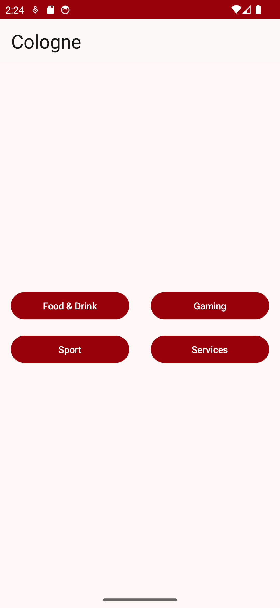
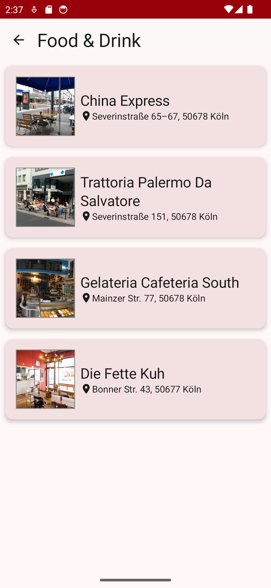
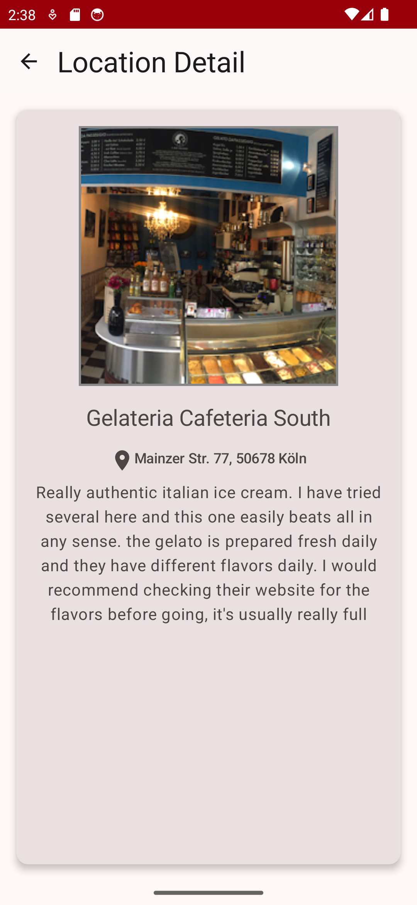
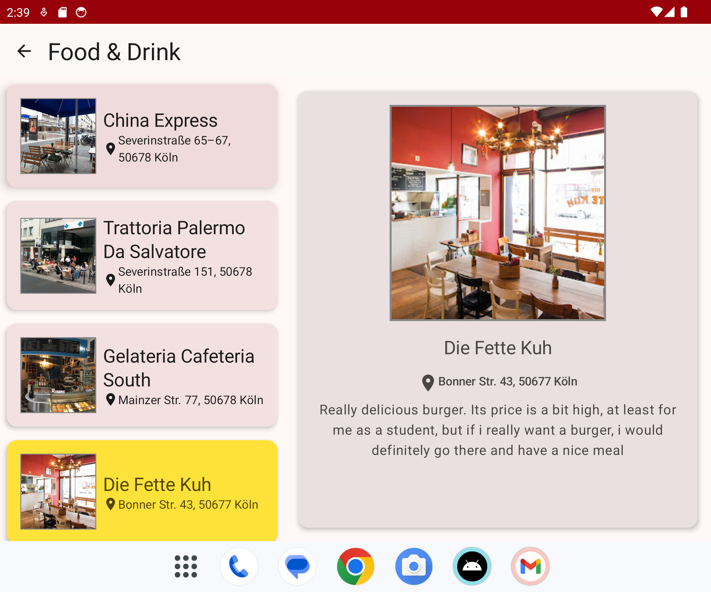
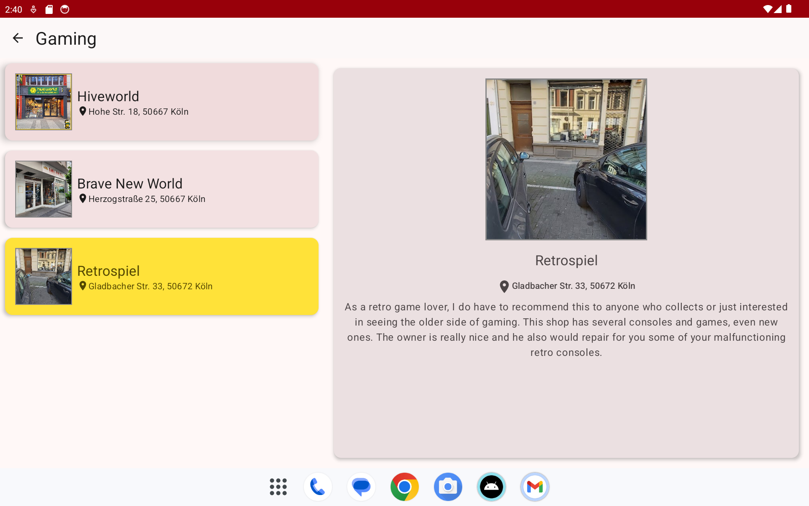

# Cologne
In this app, I recommend some locations to check out in Cologne.
To build this app, I have used 
- Jetpack Compose
- ViewModel
- UiState
- StateFlow
- Navigation
- adaptable for different screen sizes
## Screenshots

Here are the screenshots of the application displayed:
### On a Phone

  
  
  

### On a Foldable Phone

  

### On a Tablet

  

